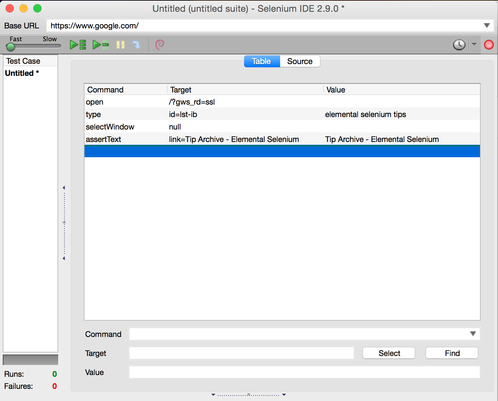

## The Problem

Selenium IDE is a useful tool if you're new to Selenium. While it enables you to quickly record and playback test cases that you can save and re-use later, it's not a good long-term solution for several reasons.

The biggest is that the Selenium Community advocates and helps support a much more reliable and robust approach. And the first step in getting there is to export your tests from Selenium IDE (or Selenium Builder).

Let's dig in with an example.

## An Example

With a simple test case set up in Selenium IDE we're ready to get started.



It does the following:

- Loads Google
- Searches `element selenium tips`
- Asserts that the page contains the text we expect

Exporting a test is just a couple of clicks away. The best option given our preference (Ruby and WebDriver) is to use the `Ruby / RSpec / WebDriver` option from the menu.


After saving this Ruby file to somewhere on disk we open it up and behold the massive amount of code that was just generated.

```ruby
# filename: search.rb

require "json"
require "selenium-webdriver"
require "rspec"
include RSpec::Expectations

describe "Search" do

  before(:each) do
    @driver = Selenium::WebDriver.for :firefox
    @base_url = "https://www.google.com/"
    @accept_next_alert = true
    @driver.manage.timeouts.implicit_wait = 30
    @verification_errors = []
  end

  after(:each) do
    @driver.quit
    @verification_errors.should == []
  end

  it "test_search" do
    @driver.get(@base_url + "/?gws_rd=ssl")
    @driver.find_element(:id, "lst-ib").clear
    @driver.find_element(:id, "lst-ib").send_keys "elemental selenium tips"
    # ERROR: Caught exception [ERROR: Unsupported command [selectWindow | null | ]]
    (@driver.find_element(:link, "Tip Archive - Elemental Selenium").text).should == "Tip Archive - Elemental Selenium"
  end

  def element_present?(how, what)
    ${receiver}.find_element(how, what)
    true
  rescue Selenium::WebDriver::Error::NoSuchElementError
    false
  end

  def alert_present?()
    ${receiver}.switch_to.alert
    true
  rescue Selenium::WebDriver::Error::NoAlertPresentError
    false
  end

  def verify(&blk)
    yield
  rescue ExpectationNotMetError => ex
    @verification_errors << ex
  end

  def close_alert_and_get_its_text(how, what)
    alert = ${receiver}.switch_to().alert()
    alert_text = alert.text
    if (@accept_next_alert) then
      alert.accept()
    else
      alert.dismiss()
    end
    alert_text
  ensure
    @accept_next_alert = true
  end
end
```

This code will work if you run it, but a lot of it is not being used in this example. And there are some things going on that are not very efficient or effective.

So let's rework it and wrap it in a leaner shell.

## A Better Example

```ruby
# filename: search.rb

require 'selenium-webdriver'

describe 'Search' do

  before(:each) do
    @driver = Selenium::WebDriver.for :firefox
    @driver.manage.timeouts.implicit_wait = 30
  end

  after(:each) do
    @driver.quit
  end

  it "works" do
    @driver.get("http://google.com")
    @driver.find_element(:id, "lst-ib").clear
    @driver.find_element(:id, "lst-ib").send_keys "elemental selenium tips"
    expect(@driver.find_element(:link, "Tip Archive - Elemental Selenium").text).to eql(
      "Tip Archive - Elemental Selenium")
  end

end
```

We're left with the basics required to make our test work. By removing the unused helper methods from the generated code we are left with a much leaner and cleaner test. We'll eventually need some of the things we removed, but that's for a later time. If you're just getting started then what we ended up with is sufficient.

## Expected Outcome

If you save this file and run it (e.g., `rspec search.rb` from the command line) here is what will happen:

- Open the browser
- Visit Google
- Search for `elemental selenium tips`
- Wait for the first search result to render
- Grab the text from it
- Assert that the text for it is what we expect

## Outro

If you see a lot of Selenium IDE exporting in your future then I recommend adding your own formatter to Selenium IDE and using that to instead of the built in ones. This can be done from the Options menu within Selenium IDE (e.g., click `Options` > `Options`, select the `Formats` tab, and click `Add`). It should be pretty straight-forward to wire one up and customize it after you look at the other formatters as examples.

But ideally, with enough practice and proper abstractions in place you'll be able to write your tests quickly and without the need for Selenium IDE. If you want a complete guide on how to do this, be sure to check out [The Selenium Guidebook](https://seleniumguidebook.com/).

Happy Testing!
